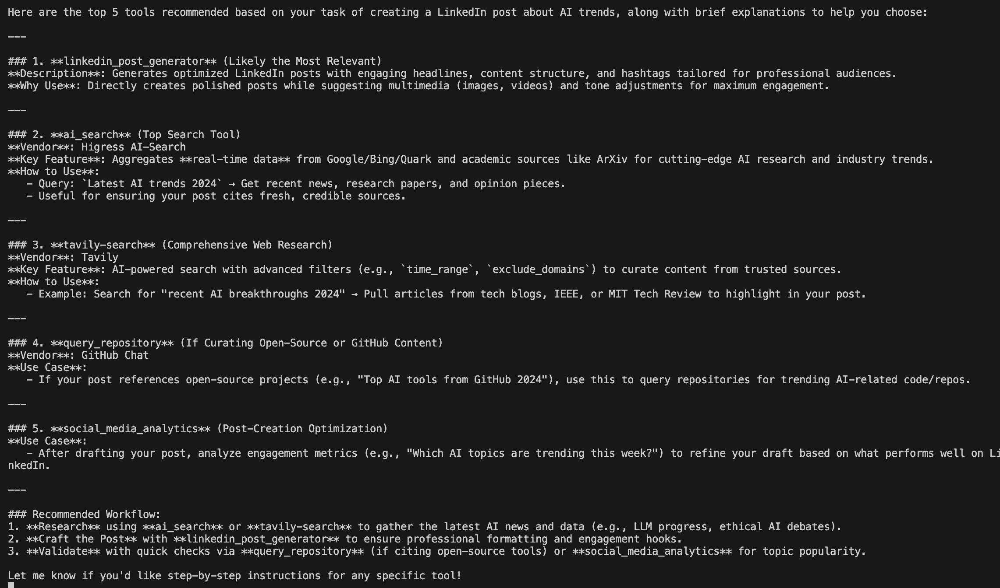

# 🔗 Unified MCP Tool Graph: A Intelligence Layer for Dynamic Tool Retrieval

**Unified MCP Tool Graph** is a research-driven project that aggregates and structures tool APIs from diverse **Model Context Protocol (MCP) servers** into a centralized **Neo4j graph database**. This graph functions as an intelligent infrastructure layer that enables **large language models (LLMs)** and **agentic AI systems** to **dynamically retrieve** the most relevant tools for any task — without being overwhelmed by redundant or confusing options.

**Single MCP for connecting to all MCP's available**

> 🔬 This repository focuses on the creation and evolution of the **Unified Tool Graph Database**. Chatbot-based integration (e.g., LangChain) is treated as a modular extension of this foundational layer.

> 📢 Support for Cline, IDE's coming soon..

---

## 🧠 Research Problem

As LLMs and autonomous agents evolve to interact with external tools and APIs, a critical bottleneck has emerged:

> **How can models efficiently select the right tool from an ever-expanding universe of APIs — without going into infinite loops or picking the wrong ones?**

### Why This Happens:
- 🔀 **Tool Confusion:**  
  LLMs struggle when many tools offer similar functions (e.g., `create_post`, `schedule_post`, `post_to_social`), leading to indecision and incorrect tool calls.
  
- ↺ **Infinite Chains:**  
  Without a structured understanding of tool differences, LLMs often get stuck in unproductive chains, calling tools repetitively or selecting suboptimal ones.

- 🧱 **Unstructured Access:**  
  Most current implementations dump all available tools into the LLM's context, overwhelming it with options and increasing hallucination risks.

---


## ✅ Solution: The Unified MCP Tool Graph

This project proposes a structured, queryable solution: a **vendor-agnostic Neo4j graph database** of tools/APIs sourced from MCP servers (e.g., LinkedIn, Google, Facebook, Notion, etc.).

### 🔍 Key Capabilities:
- **Centralized Tool Intelligence:**  
  Store API descriptions, metadata, parameters, and inter-tool relationships in a graph format.

- **LLM-Friendly Query Layer:**  
  Agents can retrieve only the 3–4 most relevant tools per task using metadata and relationships, minimizing confusion.

- **Semantic Differentiation:**  
  Capture similarities and differences between tools using graph relationships (e.g., `overlaps_with`, `extends`, `preferred_for_task`) to guide decision-making.

---

## 🧹 Modular Extensions

While the graph is the core, it enables powerful downstream use cases:

### 🌐 Dynamic Tool Retrieval (DTR):
> A modular LangChain/Autogen chatbot extension that queries the graph and surfaces a minimal, accurate toolset for any given user intent.

This prevents LLMs from blindly scanning a massive tool library and instead gives them just what they need to complete the job — nothing more, nothing less.

It spins up requested MCP Servers on demand and disable them when not needed.

---

## 🧱 Core Objectives

| Goal | Description |
|------|-------------|
| **📦 Tool Ingestion** | Fetch APIs and schemas from public/private MCP servers and normalize them |
| **🧽 Tool Relationship Mapping** | Define graph edges like `overlaps_with`, `requires_auth`, `preferred_for`, `belongs_to_vendor` |
| **🔍 LLM-Oriented Queries** | Return task-specific tool bundles in real time |
| **🌱 Scalable Ecosystem** | Continuously add vendors and tools without retraining or hardcoding |
| **🔗 Agent-Aware Structure** | Guide LLM reasoning with metadata-rich, searchable tool representations |

---

## 🌟 Key Advantages

- 🧠 **Reduces Tool Confusion in LLMs**  
  Prevents tool overload by showing only task-relevant options. Avoids infinite call loops and incorrect tool selections.

- ↻ **Vendor-Agnostic Integration**  
  Unifies APIs from different providers into a single intelligent system.

- 🔗 **Maps Interoperability**  
  Captures how tools relate or depend on each other, useful for chaining APIs in workflows.

- ⚡ **Optimized Agentic Reasoning**  
  Empowers LLMs to reason efficiently with fewer distractions in the context window.

- 🚀 **Scalable & Modular**  
  Can be updated independently of LLM or chatbot infrastructure. Extendable across any agent stack.

---

## 📌 Example Use Cases

- **"I want to schedule a post on LinkedIn and share it in Slack."**  
  → Graph returns only the relevant `create_post`, `schedule_post`, and `send_message` tools.

- **Custom AI Assistants for Enterprises:**  
  Only expose internal tools from the graph, filtered by access, scope, or function.

- **Smart Recommender Agents:**  
  Suggest best-matched tools based on tags, popularity, success rate, or dependencies.

---

## 🧪 Coming Soon

- ✅ **Graph Ingestion Scripts**
- ✅ **Schema Blueprint + Cypher Queries**
- ✅ **Tool Visualization Playground**
- ✅ **LangChain DTR Chatbot Plug-in**
- ✅ **How-to Tutorials & Use Cases**

---

## 🚀 Getting Started

```bash
git clone https://github.com/your-username/unified-mcp-tool-graph.git
cd unified-mcp-tool-graph
# Coming soon: ingestion pipeline, schema docs, and sample queries
```

---

## 🙌 Contributing

If you’re passionate about agentic AI, graph databases, or LLM integration — we’d love your help!

- 🧠 Submit ideas or vendor sources
- 🛠️ Open PRs for schema/design improvements
- ⭐ Star the repo to support this research

---

## 📜 License

MIT License — free for academic, personal, and commercial use.

---

## 🧠 Summary

Instead of dumping 100+ tools into a model’s prompt and expecting it to choose wisely, the **Unified MCP Tool Graph** equips your LLM with structure, clarity, and relevance.

It **fixes tool confusion**, **prevents infinite loops**, and enables **modular, intelligent agent workflows**.

Let’s build smarter systems — one tool graph at a time.

---

🔗 **Star the repo to follow the journey and make tools truly *intelligent, searchable, and modular*.**

## Updates on Development
Clustered on multi label open-ended usecases.


Created a GraphDB with Vendor and tools with embedings for vector search.
Need a way to categorize vendors and connect vendors with same category. eg( Web Search, File System, Social Media etc.)
No of Tools Supported 11066
No of MCP Servers(Official + Community) 4161


#### Query = I want to post a linkedIn post about the latest trends in AI.



